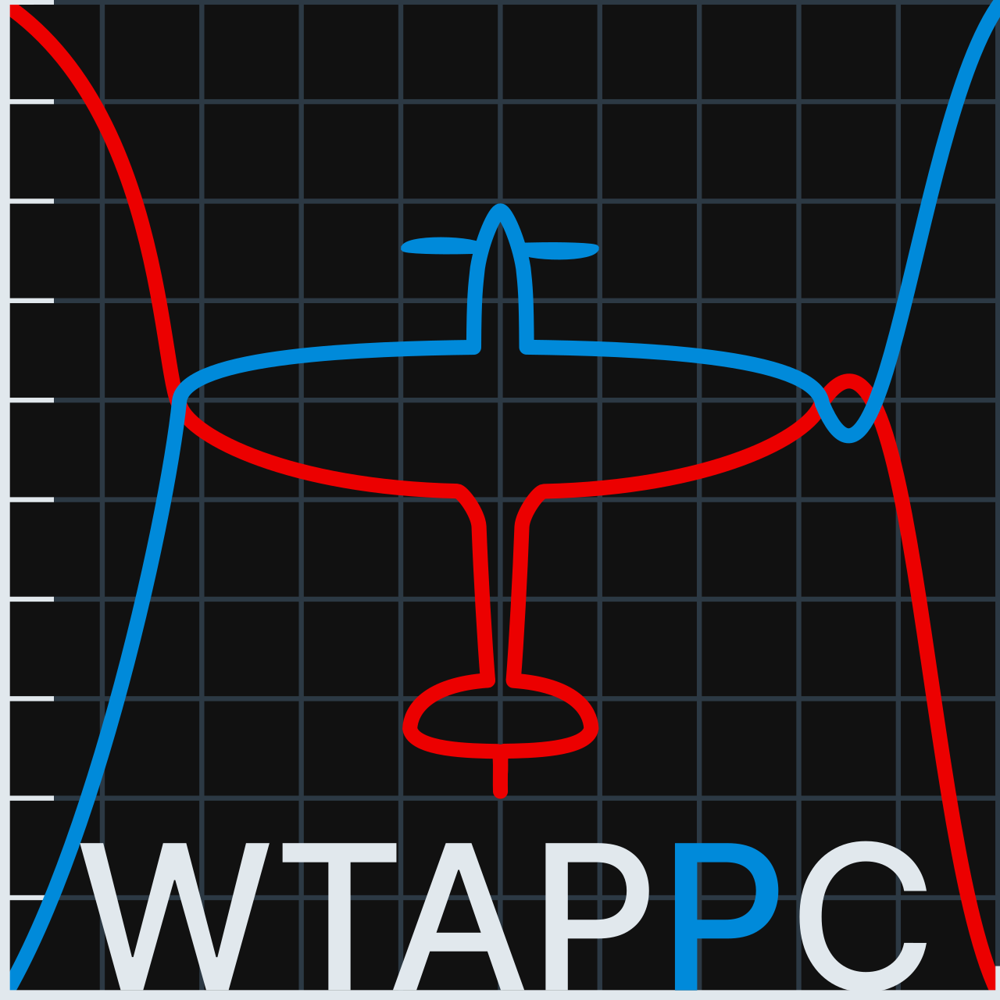
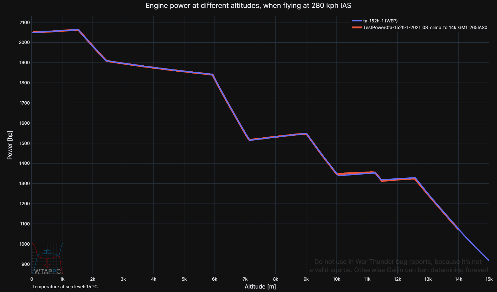

<h1>War Thunder Aircraft Performance Pre-Calculator</h1>

Pre-calculated aircraft performance files of aircraft in War Thunder. They will be visualized as graphs at [**wtapc.org**][1]. Currently those are files with:

* Engine power of all piston engine aircraft in War Thunder from -4km to 20km altitude(100% and WEP).
* Empty mass, fuel mass and armament mass of all piston engine aircraft.
* Names of flight-model files and ingame names of all piston engine aircraft.

Accuracy vs ingame engine power is within 99.5%-100.5% for almost all planes.

Importantly, this repository contains all the scripts used to calculate them, based on War Thunder flight-model files from
[the public datamine][2]. 

The goal is to calculate most important performance metrics like 1. climb rate at different speeds and altitidues and 2. top speeds.

### Guide on using scripts:

Install pipx, with:
1. First - install newest [Python][3] if you don't have it. 
2. Then clone this repository into your empty project. 
3. This repo uses [Poetry][11] for virtual environment, so to install it, follow these annoying steps: 
3.1 Install pipx cause Poery recommends that `py -m pip install --user pipx` 
3.2 Add pipx installation directoryto Path variable if it's not there. 
3.3 Install poetry using pipx, not pip! `pipx install poetry` 
3.4 Make poetry path to Path variable with `python3 -m pipx ensurepath` 
3.5 update poetry.lock file just to be sure `poetry lock --no-update` 
3.6 *If you use Visual Studio Code: run `poetry config virtualenvs.in-project true` so that virtual environments are noticed by VS 
3.7 Finally create v-env with the needed packages via `poetry install`. 

Done, everything should work good.
Scripts are in `performance_calculators`. 

If you want to recalculate engine power, mass etc. files based of the newest WT datamine version:
1. run `batch_runner.py`. It runs all the scripts of the repository and is interactive so you can choose what to run.

If you want to compare those calculations with actual engine power data from War Thunder:

1. Climb in a plane of your choice in War Thunder test flight, at a constant IAS or TAS speed while logging engine power and altitude with [WTRTI][5]. 
2. Put the log .csv file in 'ingame_power_log_files' folder. 
3. Open `local_power_graph_script.py` and put the name of the log into `TEST_file_dir`.
4. Choose the same plane in `fm_files`, same speed and speed type.
5. Run the script and enjoy a graphs like this one!

If you want to learn how engine power is calculated in War Thunder, study `plane_power_calculator.py`, the most impoartant file in the repository. But it's very complicated (long and not coded very well). It took over a year to make via trial and error.

If you want to compare performace of different planes, better wait and once completed visit [**wtapc.org**][1], it's more user friendly.

### Pre-made files:
Pre-made .json files are in `output_files`.
Engine power files have long arrays of numbers, which are engine power values at 0 forward speed (no ram air effect). Altitude is **implicit** - first value is at -3990m, second at 3980m, then at 3970m etc.... up to the last value in each array with engine power at 20000m.

The reason engine power starts at -4km is to account for ram air effect. When a plane is flying very fast at sea level, air is rammed at high pressure into the engine air intake so it's **effectively** at -1 <-> -3km depending on the air intake ram efficiency. If those values weren't calculated it'd not be possible to plot WT engine power at low altitude and high speed.

`speed_mult` in those .json files is the efficiency of the air intake at transferring dynamic pressure of air into the super/turbocharger - efficiency of the air ram effect. it's an important variable used by `rameffect_er` function, needed by the website to apply the air ram effect to the values from .json.

### Known issues - contribution appreciated:
P-63 A-10, A-5 and C5 engine power graphs don't match ingame engine power very well. These 3 are calculated in a unique way; engine power above critical altitude doesn't drop proportionally to air pressure drop (concave), but in a convex way, and that's difficult to model. (look for `ConstRPM_bends_above_crit_alt` function in `plane_power_calculator`, it's made to distinguish these 2). 
Tu-1 power is almost precise but also not exact.

### Future additions - contribution appreciated:
<ol>
<li>Propeller efficiency -> thrust -> thrust to weight of propeller aircraft</li>
<li>Thrust and thrust to weight of jets</li>
<li>The goal - climb rates and top speeds of all aircraft at all altitudes</li>
</ol>

For propeller efficiency and prop thrust, there's `prop_efficiency_calculator.py`, which doesn't work yet.

---

### Related Links:
[**wtapc.org GitHub repository**][5]

### Thanks:

* [gszabi99][6] and Oshida - Providing a reliable up to date [datamine][2] of WT flight-model files, essential for the project to even exist. 

* [\_avb\_][7] - Making [WTRTI][4], a tool necessary to make ingame engine power/altitude graphs. I used them as a comparison to calculated engine power during development. Without WTRTI, the project would take many more years to get to this stage.

* [Xelph][12] - Helping to set up repo and GitHub Pages of wtapc.org. Advice on website-making and propeller efficiency.

* [dogeness][8] Explaining how aero piston engines works IRL and in WT (a good read [here][9]), which helped figure out how to calculate engine power. Advice on graphs layout.

* [AdamTheEnginerd][10] - A very big inspiration to start visualizing aircraft performance.

[1]: https://www.wtapc.org
[2]: https://github.com/gszabi99/War-Thunder-Datamine
[3]: https://www.python.org/downloads/
[4]: https://mesofthorny.github.io/WTRTI/
[5]: https://github.com/Alpakinator/wt-aircraft-performance-calculator
[6]: https://github.com/gszabi99
[7]: https://github.com/MeSoftHorny
[8]: https://www.youtube.com/@dogeness/videos
[9]: https://docs.google.com/document/d/1fp7rpu-Bqh7uFjMg7sCQlMZgf6pIoJ_qfRzihc6iIB4/edit
[10]: https://www.youtube.com/@AdamTheEnginerd
[11]: https://python-poetry.org/docs/
[12]: https://github.com/HypheX
