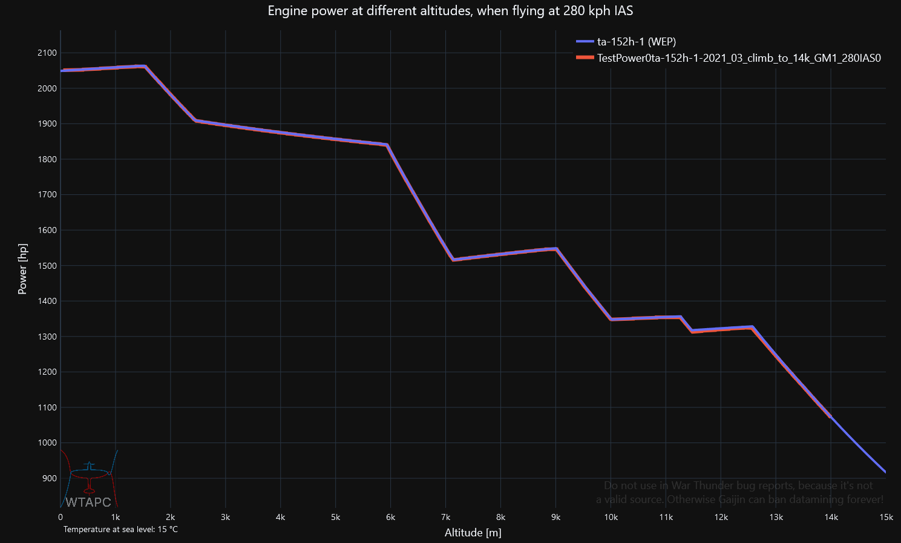

<h1>War Thunder Aircraft Performance Calculator (data)</h1>

Flight model files of all aircraft in War Thunder that will be used to calculate aircraft performance and make graphs of it, at [**wtapc.org**][1]. Files made based on [the public datamine][2], but in an unified format (`output_files/out_fm/`). 

### Related:
[**Discord of WTAPC**][13] 
[**GitHub repository of WTAPC website**][5] It's the main part of the WTAPC project.

Also:
* Pre-made engine power files of all piston engine aircraft in War Thunder from -4km to 20km altitude(military power and WEP) in `output_files/plane_power_files/`. wtapc.org uses them.
* Empty mass, fuel mass and armament mass file of all piston engine aircraft ()`output_files/plane_mass_files/`). wtapc.org uses them.
* Names of flight-model files and ingame names of all aircraft (`output_files/plane_name_files/`).
* **All the scripts used to make these files (`performance_calculators/`).**

Accuracy vs ingame engine power is within 99%-101% for vast majority of planes and 95%-105% for the rest.

### Guide on using scripts:
1. First - install [Python][3] 3.12 or 3.13 if you don't have it. 
2. Then clone this repository into your empty project. 
3. This repo uses [uv][11] for virtual environment and package management. Follow its [setup guide][14].

Done, everything should work good. 

If you want to recalculate engine power files, mass file, flight model files based of the newest WT datamine version:
1. run `batch_runner.py`. It runs all the scripts of the repository and is interactive so you can choose what to run. Running each step deletes exisitng pre-made files. So remake unified flight model files only if you don't care about the existing ones from older War Thunder versions(on all those folders in `output_files/out_fm/`).

If you want to compare calcuated engine power with actual engine power data from War Thunder:

1. Climb in a plane of your choice in War Thunder test flight, at a constant IAS or TAS speed while logging engine power and altitude with [WTRTI][4]. 
2. Put the log .csv file in 'ingame_power_log_files' folder. 
3. Open `local_power_graph_script.py` and put the name of the log into `TEST_file_dir`.
4. Choose the same plane in `fm_files`, same speed and speed type.
5. Run the script and enjoy a graphs like this one!

If you want to learn how engine power is calculated in War Thunder, study [**GitHub repository of WTAPC website**][5] as it is has updated, currently used calculation methods. Alternatively read though `plane_power_calculator.py`, the original, older version, but it's very complicated (long and not coded very well). It took over a year to make via trial and error.

If you want to compare performace of different planes visit [**wtapc.org**][1], it's more user friendly.

### Legacy Pre-made files:
They were used by [**wtapc.org**][1] to save on computation on the client.
In engine power files 'military' refers to 100% throttle power setting in game, while WEP (War Emergency Power) is 110%.
They contain long arrays of numbers, which are engine power values at 0 forward speed (no ram air effect). Altitude is **implicit** - first value is at -3990m, second at 3980m, then at 3970m etc.... up to the last value in each array with engine power at 20000m.

The reason engine power starts at -4km is to account for ram air effect. When a plane is flying very fast at sea level, air is rammed at high pressure into the engine air intake so it's **effectively** at -1 <-> -3km depending on the air intake ram efficiency. If those values weren't calculated it'd not be possible to plot WT engine power at low altitude and high speed.

`speed_mult` in those .json files is the efficiency of the air intake at transferring dynamic pressure of air into the super/turbocharger - efficiency of the air ram effect. it's an important variable used by `rameffect_er` function, needed by the website to apply the air ram effect to the values from .json.

---

### Thanks:

* [gszabi99][6] and Oshida - Providing a reliable up to date [datamine][2] of WT flight-model files, essential for the project to even exist. 

* [\_avb\_][7] - Making [WTRTI][4], a tool necessary to make ingame engine power/altitude graphs. I used them as a comparison to calculated engine power during development. Without WTRTI, the project would take many more years to get to this stage.

* [Xelph][12] - Helping to set up repo and GitHub Pages of wtapc.org. Advice on website-making and propeller efficiency.

* [dogeness][8] Explaining how aero piston engines works IRL and in WT (a good read [here][9]), which helped figure out how to calculate engine power. Advice on graphs layout.

* [AdamTheEnginerd][10] - A very big inspiration to start visualizing aircraft performance.

[1]: https://www.wtapc.org
[2]: https://github.com/gszabi99/War-Thunder-Datamine
[3]: https://www.python.org/downloads/
[4]: https://mesofthorny.github.io/WTRTI/
[5]: https://github.com/Alpakinator/wt-aircraft-performance-calculator.org
[6]: https://github.com/gszabi99
[7]: https://github.com/MeSoftHorny
[8]: https://www.youtube.com/@dogeness/videos
[9]: https://docs.google.com/document/d/1fp7rpu-Bqh7uFjMg7sCQlMZgf6pIoJ_qfRzihc6iIB4/edit
[10]: https://www.youtube.com/@AdamTheEnginerd
[11]: https://github.com/astral-sh/uv
[12]: https://github.com/LFS6502
[13]: https://discord.gg/6F7ZRk3zJG
[14]: https://docs.astral.sh/uv/getting-started/
